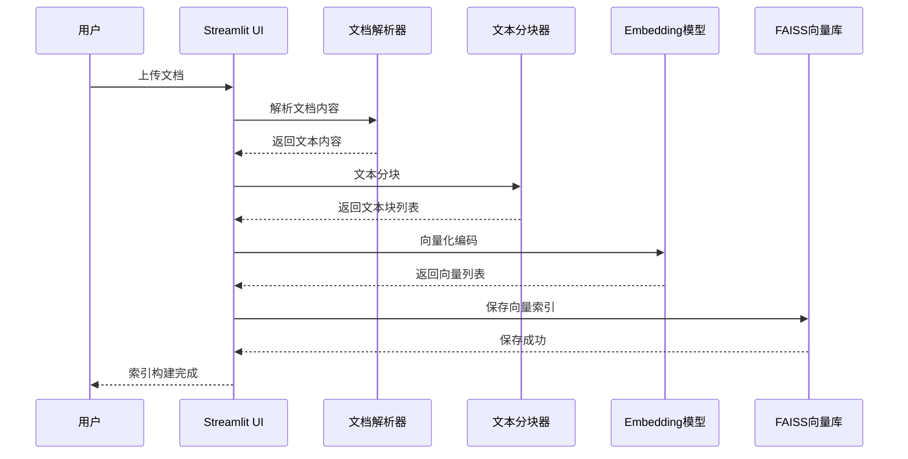
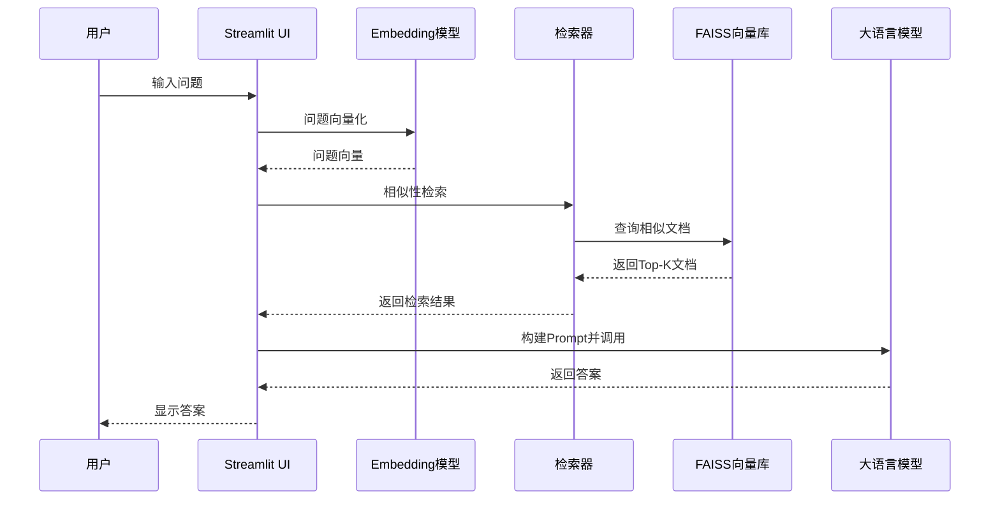
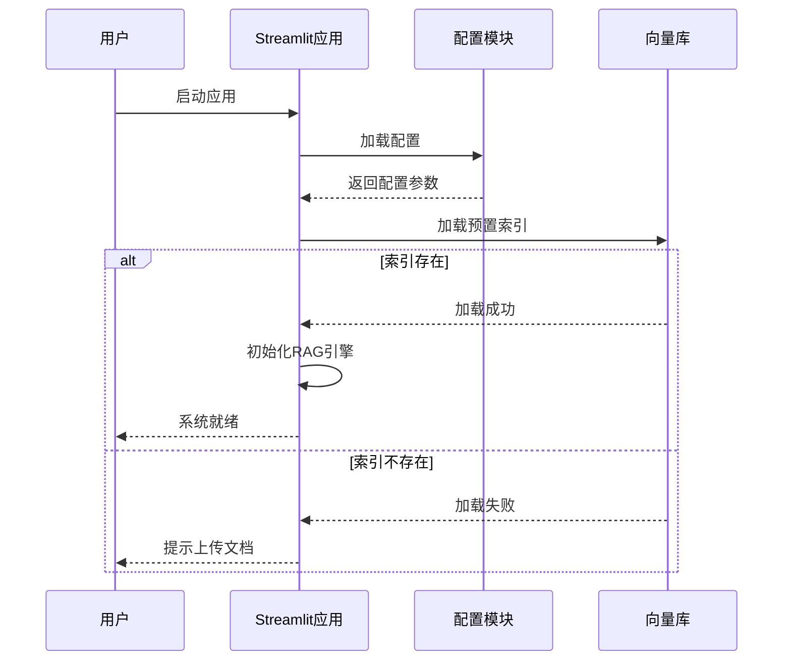
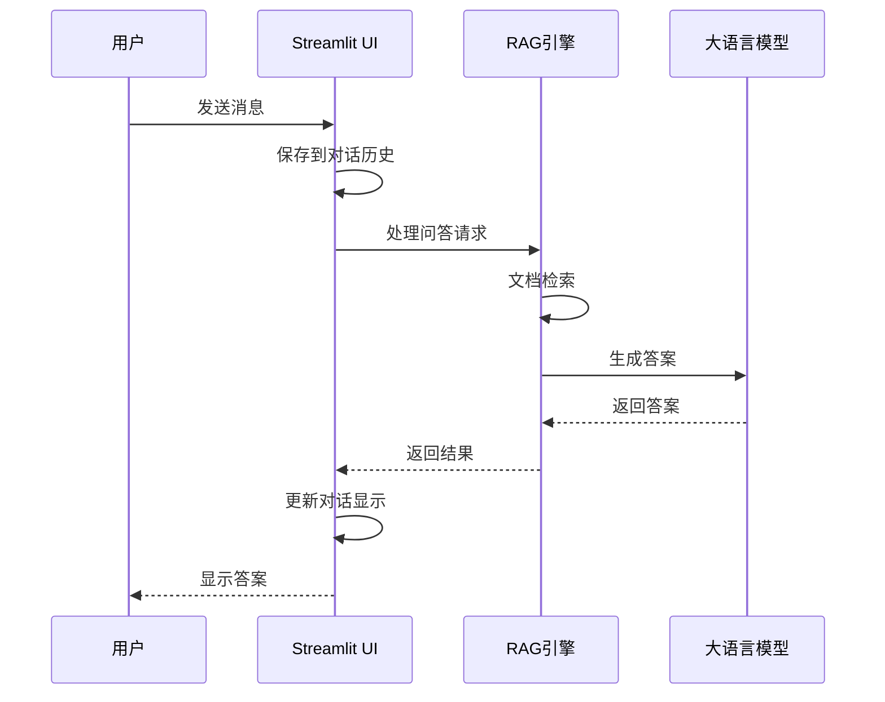

# 系统架构文档

## 一、架构概览

本项目采用分层架构设计，主要分为三层：前端展示层、业务逻辑层、数据存储层。

```
┌─────────────────────────────────────────────────────────────┐
│                    前端展示层 (Frontend)                    │
│  ┌─────────────────────────────────────────────────────┐   │
│  │  Streamlit Web UI                                  │   │
│  │  - 对话界面、文档上传、历史记录、系统设置            │   │
│  └─────────────────────────────────────────────────────┘   │
├─────────────────────────────────────────────────────────────┤
│                    业务逻辑层 (Backend)                    │
│  ┌─────────────────────────────────────────────────────┐   │
│  │  RAG Engine                                         │   │
│  │  ┌─────────┐  ┌───────────┐  ┌─────────────┐       │   │
│  │  │ 文档解析 │→ │ 文本分块  │→ │ 向量化编码  │       │   │
│  │  └─────────┘  └───────────┘  └──────┬──────┘       │   │
│  │                                     ↓               │   │
│  │                          ┌───────────────────┐       │   │
│  │                          │   向量检索       │       │   │
│  │                          │ (BM25+向量混合)  │       │   │
│  │                          └────────┬────────┘       │   │
│  │                                   ↓               │   │
│  │                          ┌───────────────────┐       │   │
│  │                          │   LLM 问答生成    │       │   │
│  │                          └───────────────────┘       │   │
│  └─────────────────────────────────────────────────────┘   │
├─────────────────────────────────────────────────────────────┤
│                    数据存储层 (Storage)                     │
│  ┌─────────────┐  ┌──────────────┐  ┌────────────────┐    │
│  │  向量数据库 │  │  对话历史    │  │   知识库文档   │    │
│  │  (FAISS)   │  │  (JSON/SQL)  │  │  (PDF/DOCX/..)│    │
│  └─────────────┘  └──────────────┘  └────────────────┘    │
└─────────────────────────────────────────────────────────────┘
```

## 二、模块划分

### 2.1 前端展示层

| 模块 | 功能 | 技术实现 |
|------|------|----------|
| **对话界面** | 消息展示、输入框、发送按钮 | Streamlit Chat Elements |
| **文档管理** | 文件上传、列表展示、删除操作 | Streamlit File Uploader |
| **历史记录** | 对话历史展示、恢复、删除 | Custom Components |
| **系统设置** | 模型配置、参数调整 | Streamlit Sidebar |
| **系统状态** | 索引状态、文档数量、加载时间 | Streamlit Metrics |

### 2.2 业务逻辑层

#### 2.2.1 文档处理模块

```
文档上传 → 格式检测 → 内容提取 → 文本清洗 → 分块处理
    ↓
   文档类型判断（PDF/DOCX/TXT等）
    ↓
   使用对应解析器提取文本
    ↓
   去除多余空白、特殊字符
    ↓
   按固定长度切分（默认512 tokens）
```

#### 2.2.2 向量化模块

```
文本块 → Embedding 编码 → 向量存储
    ↓
   使用配置的 Embedding 模型
    ↓
   生成固定维度向量（如 1536 维）
    ↓
   存储到 FAISS 向量库
```

#### 2.2.3 检索模块

```
用户提问 → 向量化 → 相似性检索 → 结果排序 → 返回Top-K
    ↓
   BM25 检索 + 向量检索
    ↓
   融合排序（可配置权重）
    ↓
   返回最相关的 N 个文档片段
```

#### 2.2.4 问答生成模块

```
用户问题 + 检索结果 → Prompt 构建 → LLM 调用 → 答案生成
    ↓
   构建 RAG Prompt 模板
    ↓
   调用配置的 LLM 模型
    ↓
   流式返回答案
```

### 2.3 数据存储层

| 存储类型 | 存储方式 | 路径 |
|----------|----------|------|
| **向量索引** | FAISS | `./{system}_faiss_index/` |
| **对话历史** | JSON | `./chat_histories/` |
| **知识库文档** | 原始文件 | `./knowledge_bases/` |
| **系统日志** | 文本文件 | `./logs/` |

## 三、数据流

### 3.1 文档上传与索引流程



### 3.2 问答流程



## 四、组件交互时序

### 4.1 系统启动时序



### 4.2 对话时序



## 五、关键设计决策

### 5.1 向量数据库选择

| 方案 | 优点 | 缺点 | 适用场景 |
|------|------|------|----------|
| **FAISS** | 轻量、快速、无需额外服务 | 不支持分布式、增量更新有限 | 中小规模、单机部署 |
| **Chroma** | 支持增量更新、API友好 | 需要额外进程 | 中等规模、需要动态更新 |
| **Qdrant** | 支持分布式、高性能 | 部署复杂 | 大规模、生产环境 |

**当前选择**: FAISS（轻量、易部署，适合开源项目）

### 5.2 检索策略

采用 **BM25 + 向量混合检索**：
- BM25：传统关键词匹配，擅长精确匹配
- 向量检索：语义相似性匹配，擅长理解语义
- 融合方式：可配置权重（alpha参数），默认 BM25:0.3, 向量:0.7

### 5.3 文档分块策略

| 参数 | 默认值 | 说明 |
|------|--------|------|
| chunk_size | 512 | 每个文本块的 token 数 |
| chunk_overlap | 50 | 相邻块的重叠 token 数 |
| separator | "\n\n" | 优先按段落切分 |

## 六、扩展设计

### 6.1 多知识库支持

```
knowledge_bases/
├── common/          # 通用知识库
├── legal/           # 法律知识库
├── medical/         # 医疗知识库
├── education/       # 教育知识库
├── finance/         # 金融知识库
└── tech/            # IT技术知识库
```

### 6.2 模型切换支持

支持多种 LLM 和 Embedding 模型的热切换：
- LLM: OpenAI、智谱、Ollama 本地模型
- Embedding: OpenAI、Sentence-Transformers、M3E、BGE

---

**版本**: v2.0  
**最后更新**: 2026年
