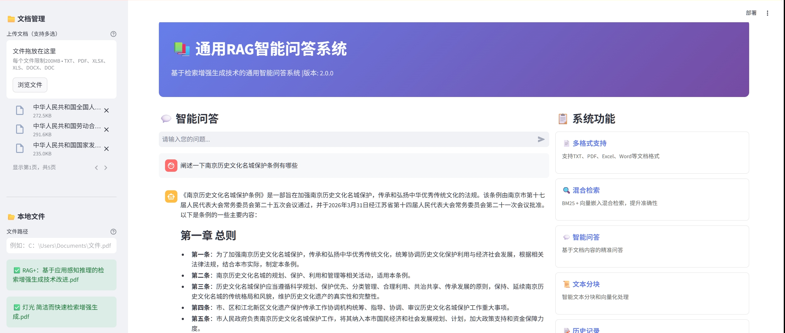
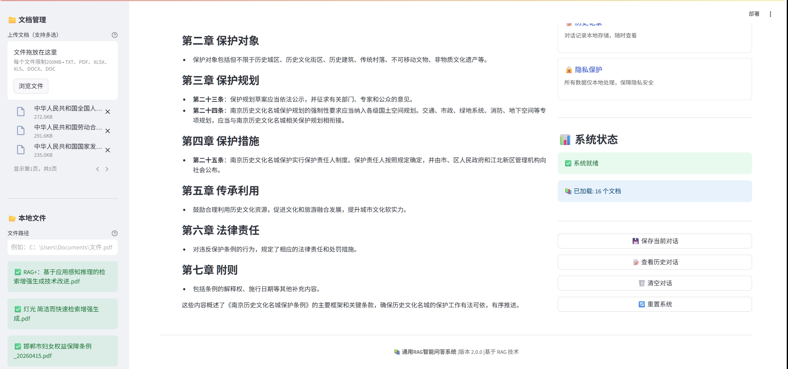
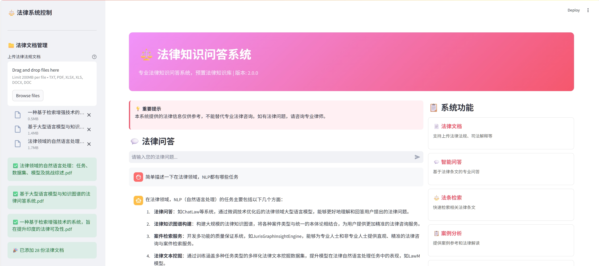
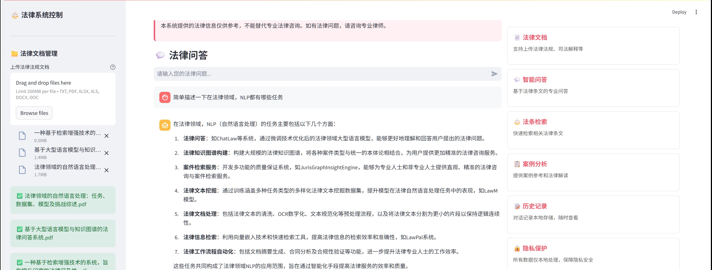
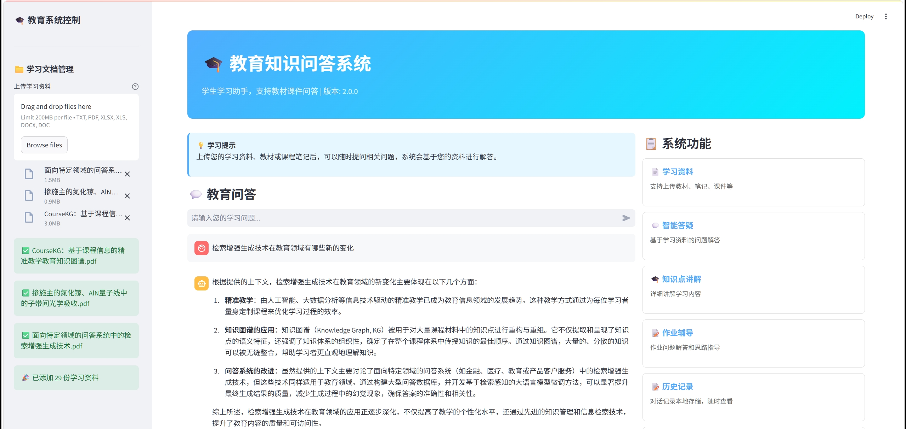
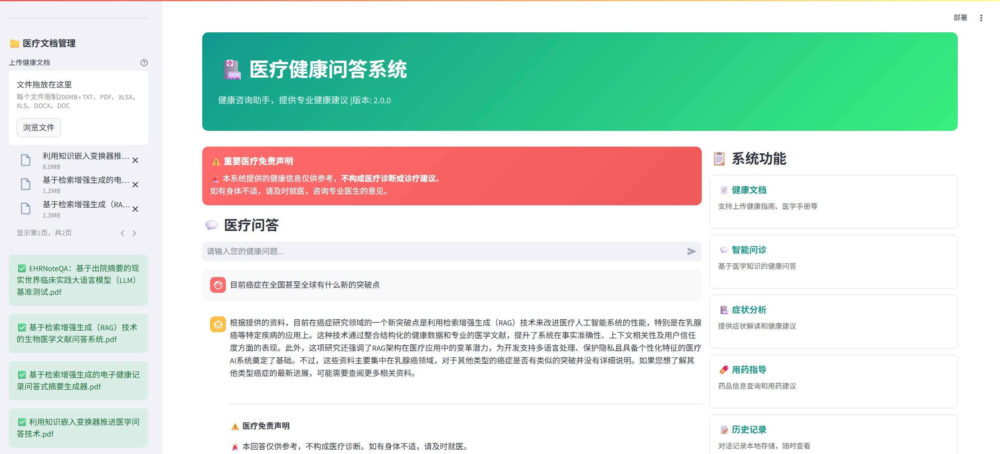
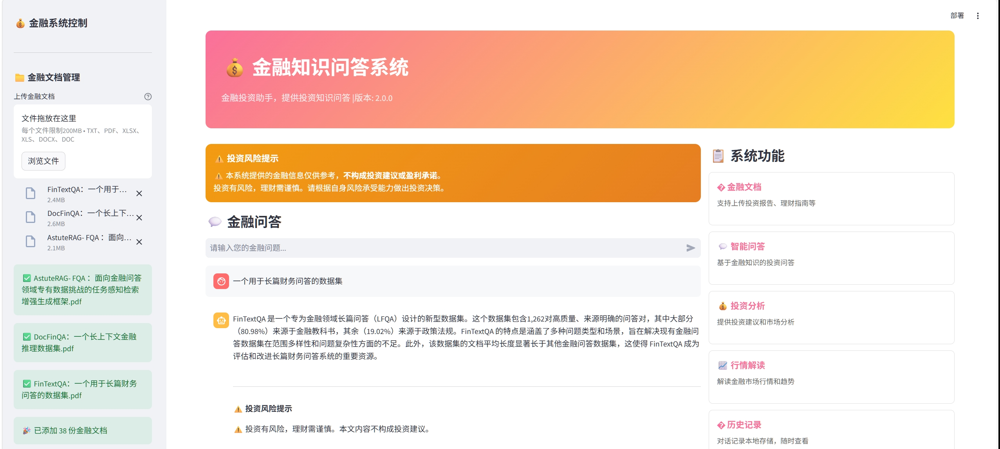
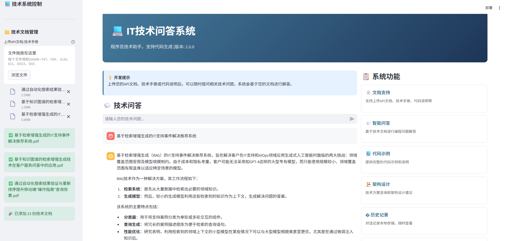
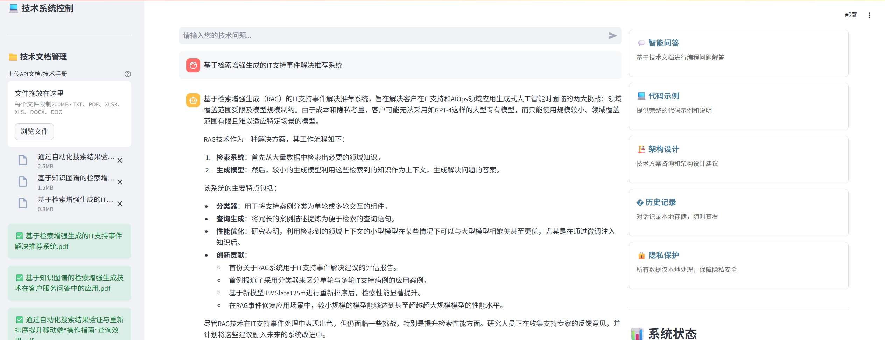

# RAG 智能知识问答系统

<div align="center">


**基于 RAG（检索增强生成）技术的企业级智能问答系统解决方案**

[📖 文档](README.md) | [📝 知乎文章](https://zhuanlan.zhihu.com/p/2036839001018118603) | [📊 A2A协议AI智能体PPT (带水印)](https://github.com/Hxdmou/legal-rag-qa-system/raw/main/A2A_PROTOCOL_AI_AGENT_2026_V17_%E5%B8%A6%E6%B0%B4%E5%8D%B0.pptx) | [🔌 API文档](docs/api_example.md) | [🤝 贡献](CONTRIBUTING.md) | [❓ FAQ](FAQ.md) | [📧 联系](mailto:business@rag-qa-system.com)

</div>

---

## 🎨 系统截图

<div align="center">

### 🤖 通用RAG智能问答系统



### ⚖️ 法律知识问答系统



### 🎓 教育学习问答系统


### 🏥 医疗健康问答系统


### 💰 金融投资问答系统


### 💻 IT技术问答系统



### 🛒 电商零售问答系统


### 🏛️ 政务服务问答系统


### 👔 人力资源问答系统


### 📚 科研学术问答系统


</div>

---

## 📚 项目简介

本项目提供**十套**独立的企业级智能问答系统，均基于 RAG（Retrieval-Augmented Generation）检索增强生成技术构建，支持私有化部署和定制开发。

### 🌟 核心特性

| 特性 | 说明 |
|------|------|
| 🔍 **混合检索** | BM25 + 向量检索双引擎，提升检索准确性 |
| 🔄 **流式输出** | 实时显示回答生成过程，体验更流畅 |
| 📦 **批量处理** | 支持批量导入问题并导出结果 |
| 💾 **数据备份** | 知识库和对话历史一键备份/恢复 |
| 👁️ **文档可视化** | 上传文档即时预览，支持多种视图 |
| 🔌 **REST API** | 轻松集成到现有业务系统 |
| 📊 **来源评分** | 显示每条引用的相关度评分 |
| 🎨 **专业UI** | 每个领域独特的视觉风格和提示 |

### 📋 系统列表

| 系统名称 | 启动文件 | 默认端口 | 适用场景 |
|----------|----------|----------|----------|
| **🤖 通用RAG智能问答系统** | `run.py` | 7861 | 通用文档问答、企业知识库 |
| **⚖️ 法律知识问答系统** | `legal_qa.py` | 7869 | 法律领域、合规咨询 |
| **🎓 教育学习问答系统** | `education_qa.py` | 7870 | 在线学习、知识管理 |
| **🏥 医疗健康问答系统** | `medical_qa.py` | 7871 | 健康咨询、医疗知识 |
| **💰 金融投资问答系统** | `finance_qa.py` | 7872 | 理财咨询、金融知识 |
| **💻 IT技术问答系统** | `tech_qa.py` | 7873 | 技术文档、API咨询 |
| **🛒 电商零售问答系统** | `e_commerce_qa.py` | 7874 | 电商运营、商品咨询 |
| **🏛️ 政务服务问答系统** | `government_qa.py` | 7875 | 政策解读、办事指南 |
| **👔 人力资源问答系统** | `hr_qa.py` | 7876 | 招聘培训、员工管理 |
| **📚 科研学术问答系统** | `academic_qa.py` | 7877 | 论文写作、文献分析 |

---

## 🚀 快速启动

### 环境要求
- Python 3.10+
- pip 包管理器

### 安装依赖

```bash
pip install -r requirements.txt
```

### 启动方式

**方式一：一键启动全部系统**
```bash
# Windows
启动RAG系统.bat

# Linux/Mac
bash start.sh
```

**方式二：选择性启动（推荐）**
```bash
# Windows - 可选择启动任意组合的系统
选择性启动.bat

# 运行后输入数字选择要启动的系统（可多选，用逗号分隔）
# 例如：输入 1,3,6 启动通用RAG、法律、IT技术三个系统
# 输入 11 启动全部10个系统
```

### 构建预置索引

首次使用前，建议构建预置索引：

```bash
python build_index.py
```

该脚本会：
- 创建示例知识库文档（医疗、教育、金融、技术等领域）
- 为10个系统分别构建向量索引
- 索引文件保存在 `{system_name}_faiss_index` 目录

> **注意**: 构建索引需要配置有效的 API key 或安装本地嵌入模型依赖。如果遇到问题，可以跳过此步骤，直接上传文档创建自定义知识库。

**方式三：单独启动某个系统**

| 系统 | 启动命令 | 访问地址 | 是否需要 GPU |
|------|----------|----------|-------------|
| 🤖 通用RAG | `streamlit run run.py --server.port 7861` | http://localhost:7861 | ❌ 否（远程API） |
| ⚖️ 法律问答 | `streamlit run legal_qa.py --server.port 7869` | http://localhost:7869 | ❌ 否（远程API） |
| 🎓 教育学习 | `streamlit run education_qa.py --server.port 7870` | http://localhost:7870 | ❌ 否（远程API） |
| 🏥 医疗健康 | `streamlit run medical_qa.py --server.port 7871` | http://localhost:7871 | ❌ 否（远程API） |
| 💰 金融投资 | `streamlit run finance_qa.py --server.port 7872` | http://localhost:7872 | ❌ 否（远程API） |
| 💻 IT技术 | `streamlit run tech_qa.py --server.port 7873` | http://localhost:7873 | ❌ 否（远程API） |
| 🛒 电商零售 | `streamlit run e_commerce_qa.py --server.port 7874` | http://localhost:7874 | ❌ 否（远程API） |
| 🏛️ 政务服务 | `streamlit run government_qa.py --server.port 7875` | http://localhost:7875 | ❌ 否（远程API） |
| 👔 人力资源 | `streamlit run hr_qa.py --server.port 7876` | http://localhost:7876 | ❌ 否（远程API） |
| 📚 科研学术 | `streamlit run academic_qa.py --server.port 7877` | http://localhost:7877 | ❌ 否（远程API） |

> **GPU 说明**: 默认使用远程 LLM API，无需 GPU。如需使用本地模型（如 Llama 3、Qwen 等），建议配备 NVIDIA GPU（显存 ≥ 16GB）以获得更好的推理性能。

---

## 🏗️ 系统架构

```
┌─────────────────────────────────────────────────────────────┐
│                    前端展示层 (Streamlit)                    │
├─────────────────────────────────────────────────────────────┤
│  ┌─────────┐ ┌─────────┐ ┌─────────┐ ┌─────────┐           │
│  │  问答UI │ │ 文档管理│ │ 历史记录│ │ 系统配置│           │
│  └────┬────┘ └────┬────┘ └────┬────┘ └────┬────┘           │
└───────┼───────────┼───────────┼───────────┼─────────────────┘
        │           │           │           │
┌───────▼───────────▼───────────▼───────────▼─────────────────┐
│                    业务逻辑层                                │
├─────────────────────────────────────────────────────────────┤
│  ┌─────────────────────────────────────────────────────┐    │
│  │              RAG 检索增强生成引擎                     │    │
│  │  ┌─────────┐    ┌─────────┐    ┌─────────────────┐ │    │
│  │  │ 文档解析 │───▶│ 文本向量化│───▶│ 向量数据库(FAISS)│ │    │
│  │  └─────────┘    └─────────┘    └────────┬────────┘ │    │
│  │                                         │          │    │
│  │  ┌──────────────────────────────────────┼──────────┤    │
│  │  │              问答生成                  │          │    │
│  │  │  检索结果 + LLM → 自然语言回答          │          │    │
│  │  └───────────────────────────────────────┘          │    │
│  └─────────────────────────────────────────────────────┘    │
└─────────────────────────────────────────────────────────────┘
        │
┌───────▼─────────────────────────────────────────────────────┐
│                    数据存储层                                │
│  ┌───────────────┐ ┌───────────────┐ ┌─────────────────┐    │
│  │ 向量索引存储   │ │ 对话历史存储   │ │ 用户文档存储     │    │
│  │ (*_faiss_index)│ │ (chat_histories)│ │ (knowledge_bases)│   │
│  └───────────────┘ └───────────────┘ └─────────────────┘    │
└─────────────────────────────────────────────────────────────┘
```

---

## ✨ 新功能

- 🔌 **REST API 接口**: 轻松集成到您的应用
- 📦 **批量问答处理**: 一键处理上千文档
- 👁️ **文档可视化**: 上传即可预览
- 💾 **导出与备份**: 数据永不丢失
- 📊 **NLP新闻分类**: 附赠舆情分析模块

---

## 📋 功能特性

### 🤖 通用RAG智能问答系统
- ✅ 支持多格式文档上传（PDF、Word、Excel、TXT）
- ✅ 智能文本分块与向量化处理
- ✅ BM25 + 向量混合检索，提升问答准确性
- ✅ 多轮对话支持，上下文保持
- ✅ 对话历史本地存储与管理
- ✅ **流式输出** - 实时显示回答生成过程
- ✅ **批量问答处理** - 批量导入问题并导出结果
- ✅ **文档可视化** - 卡片/列表/统计三种视图
- ✅ **数据备份恢复** - 知识库和对话一键备份
- ✅ **来源评分显示** - 显示引用相关度评分

### ⚖️ 法律知识问答系统
- ✅ 预置法律法规知识库
- ✅ 专业法律问题分析与解答
- ✅ 法条引用与依据说明
- ✅ 法律文书解读支持
- ✅ 自动添加法律免责声明
- ✅ 专业的法律术语解释

### 🎓 教育学习问答系统
- ✅ 教材与课件上传支持
- ✅ 学科问题智能解答
- ✅ 公式与专业术语解析
- ✅ 学习进度追踪
- ✅ 多媒体内容支持
- ✅ 知识点关联分析

### 🏥 医疗健康问答系统
- ✅ 医学文献与健康指南管理
- ✅ 健康咨询与建议生成
- ✅ 自动添加医疗免责声明
- ✅ 用药安全提醒
- ✅ 症状分析与健康提示
- ✅ 医学术语解释

### 💰 金融投资问答系统
- ✅ 金融法规与理财指南支持
- ✅ 投资知识问答
- ✅ 自动添加风险提示
- ✅ 理财产品分析
- ✅ 市场动态解读
- ✅ 投资策略建议

### 💻 IT技术问答系统
- ✅ API文档与技术手册支持
- ✅ 编程问题解答
- ✅ 代码示例生成
- ✅ 技术方案咨询
- ✅ 代码错误诊断
- ✅ 多语言代码支持

### 🛒 电商零售问答系统
- ✅ 商品知识库管理
- ✅ 电商运营策略咨询
- ✅ 客服话术生成
- ✅ 营销活动策划建议
- ✅ 商品推荐支持
- ✅ 订单处理指南

### 🏛️ 政务服务问答系统
- ✅ 政策法规解读
- ✅ 办事流程指南
- ✅ 表格下载指引
- ✅ 常见问题解答
- ✅ 在线办事入口
- ✅ 政务服务导航

### 👔 人力资源问答系统
- ✅ 招聘流程管理
- ✅ 员工培训方案
- ✅ 绩效考核支持
- ✅ 劳动合同咨询
- ✅ 员工福利解读
- ✅ HR政策问答

### 📚 科研学术问答系统
- ✅ 文献检索支持
- ✅ 论文写作指导
- ✅ 研究方法咨询
- ✅ 学术规范指引
- ✅ 论文格式模板
- ✅ 引用格式生成

---

## 📊 A2A协议AI智能体PPT

### 📁 文件信息
| 属性 | 说明 |
|------|------|
| **文件名** | `A2A_PROTOCOL_AI_AGENT_2026_V17_带水印.pptx` |
| **版本** | V17 |
| **格式** | Microsoft PowerPoint (.pptx) |
| **大小** | ~100 KB |

### 📋 PPT内容概览

#### 一、项目概述
- A2A（Agent-to-Agent）协议架构设计
- AI智能体协作框架
- 多智能体系统设计理念

#### 二、技术架构
- 应用层：GPT-5.0/6.0/7.0/8.0、Claude 3.5-Sonnet/4.0、Gemini 2.5-Flash/3.0/4.0、DeepSeek-V6/V7、Qianwen 4.0
- 协议层：HTTP/3、QUIC、gRPC 1.60、量子通信协议
- 安全层：零信任架构、mTLS、JWT、QKD量子加密、后量子密码学
- 部署层：K8s 1.29/1.30、KEDA 2.12、Argo CD、多云部署

#### 三、性能指标
- 延迟：<10ms → <5ms → <1ms
- QPS：>50万 → >100万 → >500万
- 吞吐量：>10万 req/s → >50万 req/s → 无限（量子阶段）
- 准确率：98.5% → 99.5% → 99.9%

#### 四、未来规划
- 2026-2028：通用AI智能体部署
- 2029-2035：量子AI融合
- 2036-2050：AGI研发与星际探索

#### 五、合规认证
- ISO/IEC 27001
- SOC2 Type II
- GDPR/AI Act合规

### 🚀 下载链接
- [📥 A2A协议AI智能体PPT (带水印)](https://github.com/Hxdmou/legal-rag-qa-system/raw/main/A2A_PROTOCOL_AI_AGENT_2026_V17_%E5%B8%A6%E6%B0%B4%E5%8D%B0.pptx)

---

## 📊 技术栈

| 类别 | 技术 |
|------|------|
| **前端** | Streamlit, Python |
| **后端** | LangChain, Flask |
| **向量数据库** | FAISS |
| **文档处理** | PyPDF2, python-docx, pandas |
| **LLM** | DashScope API / OpenAI API |
| **嵌入模型** | text2vec-base-chinese |
| **其他** | CORS, dotenv |

---

## 💰 定价策略

| 版本 | 功能说明 | 价格 |
|------|----------|------|
| 🎯 **基础版** | 单领域，交付代码+部署文档 | **2800元** |
| ⭐ **专业版** | 单领域+用户权限+历史记录导出 | **4800元** |
| 🏢 **企业版** | 多领域/API接口+7×24支持 | **8800元起** |
| 📋 **咨询服务** | 需求评估+技术方案 | **500元/小时**（文字问答） |

详细定价说明请查看：[PRICING.md](./PRICING.md)

---

## 🤝 商业合作与咨询

- **企业级私有化部署、领域定制、功能扩展**，请发送邮件至 **business@rag-qa-system.com**
- **技术问题或开源贡献请提交Issue**（文字沟通）
- **所有沟通仅限文字，不接受语音/视频。感谢理解。**

### 📋 定制服务标准回复
如需定制服务，请发送邮件至 `business@rag-qa-system.com`，请说明您的场景和需求。我会通过邮件文字回复方案和报价。

---

## 📋 GitHub Issue 处理承诺

- 如果有人提交Issue，**24小时内回复**
- 技术问题和建议我们会认真对待和处理

---

## ⚖️ 法律声明

### 一、重要提示

**使用本项目前，请务必仔细阅读并理解本声明的全部内容。使用本项目即表示您已充分理解并同意接受本声明的全部条款和条件的约束。**

本系统仅供**学习、研究和技术参考**之用，不提供任何形式的专业咨询服务（包括但不限于法律咨询、医疗诊断、金融投资建议、会计审计等）。系统生成的所有内容均不应作为任何决策的唯一依据，亦不应被视为专业意见或建议。

### 二、知识产权声明

1. **项目代码版权**：本项目代码基于 **MIT 许可证** 开源，**RAG智能问答系统开发团队**（以下简称"作者"）保留原始著作权及相关知识产权。
2. **原创声明**：本项目代码为独立原创开发，**不包含、不引用、不派生自任何第三方教育机构的课程内容、代码、文档或受版权保护的材料**。如有违反，作者不承担任何法律责任，全部责任由侵权方自行承担。
3. **用户内容版权**：使用者上传至本系统的所有文档、数据、文件等内容的知识产权归使用者本人或其合法授权方所有。使用者需确保对上传内容拥有合法的所有权或使用权授权，并承担由此产生的全部法律责任。
4. **禁止侵权**：严禁将任何第三方享有版权、专利权、商标权或其他知识产权的材料（包括但不限于课程视频、教材内容、商业软件、文学作品、艺术作品等）上传至本系统或用于本系统的训练、测试、推理等任何用途。

### 三、版权侵权处理机制

**本项目严格遵守《中华人民共和国著作权法》《信息网络传播权保护条例》《中华人民共和国专利法》《中华人民共和国商标法》等相关法律法规，坚决反对任何形式的侵权行为。**

1. **侵权举报**：如权利人认为本项目中的内容侵犯了您的合法权益，请通过以下方式联系作者：
   - 邮箱：business@rag-qa-system.com
   - 请提供完整的证明材料，包括但不限于：权利人身份证明、权属证明（如版权登记证书、专利证书、商标注册证等）、涉嫌侵权内容的具体描述及位置、侵权行为的详细说明

2. **处理承诺**：作者承诺在收到完整、有效的侵权通知后，于 **7个工作日内** 依法依规进行处理，包括但不限于删除涉嫌侵权内容、断开相关链接、限制相关功能等，并将处理结果书面通知举报人。

3. **免责声明**：对于使用者上传的内容引发的版权、专利、商标或其他知识产权纠纷，作者不承担任何法律责任，由上传者自行承担全部法律责任，包括但不限于赔偿损失、承担诉讼费用等。

### 四、免责声明

**在法律允许的最大范围内，作者对以下事项不承担任何明示或默示的责任：**

1. **系统功能**：本系统按"现状"提供，不提供任何明示或暗示的保证，包括但不限于对系统准确性、完整性、可靠性、安全性、适销性、稳定性或特定用途适用性的保证。作者不保证系统无错误、无故障或不间断运行。
2. **使用风险**：使用者使用本系统所产生的任何直接或间接风险，包括但不限于因信息不准确、不完整或错误导致的决策失误、业务损失、系统故障、数据丢失或损坏、设备损坏等，由使用者自行承担。
3. **专业服务替代**：本系统生成的内容仅供参考，不能替代执业律师、医师、会计师、金融顾问等专业人士的服务。使用者在做出任何重要决策前，应咨询相关专业人士的意见。
4. **第三方链接**：本系统可能包含指向第三方网站或服务的链接，作者对第三方内容的准确性、完整性、安全性、合法性不承担任何责任。
5. **AI生成内容**：本系统基于人工智能技术生成内容，可能存在错误、偏见或误导性信息。作者对AI生成内容的准确性、合法性、适用性不承担任何责任。

### 五、责任限制

**在任何情况下，作者均不对以下损失承担任何责任，无论基于合同、侵权（包括疏忽）或其他法律理论：**
- 间接损失、附带损失、特殊损失、惩罚性损失、惩戒性损失或因果性损失
- 利润损失、收入损失、数据损失、商业机会损失、商誉损失
- 即使已被告知发生此类损失的可能性，或此类损失是可预见的

### 六、条款修改与通知

1. **修改权**：作者保留随时修改、补充或删除本声明条款的权利，无需提前通知。
2. **生效方式**：修改后的声明一旦在本项目官方页面公布，即视为立即生效。
3. **接受方式**：如使用者不同意修改后的声明，有权立即停止使用本项目；继续使用本项目即视为完全接受修改后的声明。

### 七、内容使用规范

1. **合法使用**：使用者应确保在合法合规的范围内使用本系统及相关内容，不得用于违法活动或侵犯第三方合法权益。如因使用者不当使用导致的法律责任，由使用者自行承担全部责任。
2. **禁止滥用**：严禁利用本系统进行任何违法、违规或不道德的活动，包括但不限于网络攻击、数据窃取、诈骗、诽谤、骚扰等。
3. **责任自负**：使用者应对其使用本系统的行为及产生的后果承担全部法律责任。

### 八、第三方内容

本系统可能引用或包含第三方数据、观点、研究成果或链接，相关知识产权归原作者或权利人所有。作者对第三方内容的准确性、完整性、合法性不承担任何责任，亦不保证第三方内容的可用性或安全性。

---

<div align="center">

**© 2026 RAG智能问答系统 | MIT License**

**使用本项目即表示您已阅读、理解并同意接受上述全部条款的约束。**

</div>
